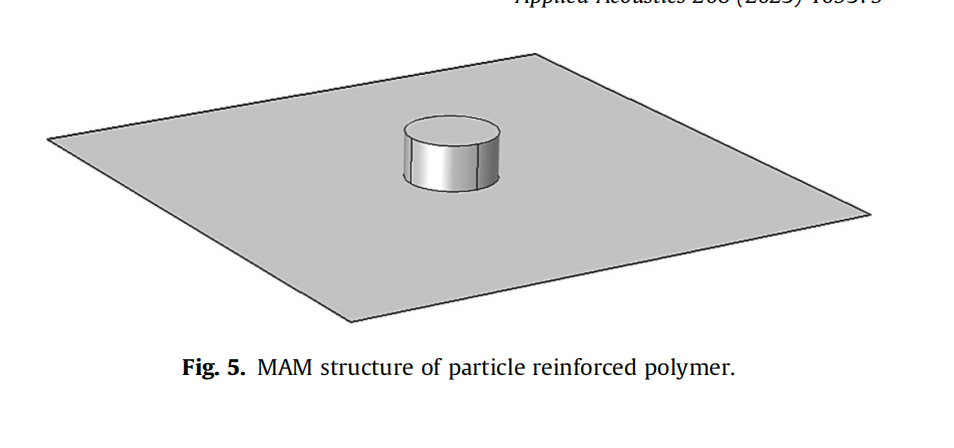

# 膜型声学超材料衰减的理论研究
**小圆形重物加正方形膜50~1000Hz**
**面密度不同的质量块传输损耗峰值不一样，越重频率越低面密度不同的**
**面密度不同的膜再1000hz以下的传输损耗几乎没差**
**膜张力（tension）：张力越大，TL峰值越高，对应频率越高**
**质量块在正方形薄膜中放置的位置对TL峰值频率影响不大**

# Study of acoustic transmission losses in particle-reinforced rubber-based membrane-type acoustic metamaterials
**乙烯丙烯橡胶EPDM，四氟乙烯共聚物材料ETFE，二者复合**
**碳纳米结构作为颗粒增强**

     